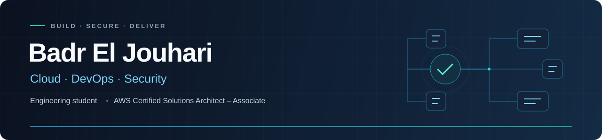

  

  
  &nbsp;
  
  &nbsp;
  

## Building cloud projects from infrastructure to delivery

I'm **Badr**, a final-year engineering student at **ENSA Fès, Morocco**, studying Digital Development and Cybersecurity, with a focus on cloud and DevSecOps. I build and deploy applications using AWS, Terraform, containers, and CI/CD, with security checks and monitoring built into the delivery process.

> **Seeking a six-month mandatory final-year internship from January 2027** in Cloud Engineering, DevOps, or DevSecOps. Open to relocation to **Germany**.

## Selected projects

<table>
  <tr>
    <td>
      <h3>01 &nbsp; <a href="https://github.com/Kimperi/ecom">AWS Serverless E-Commerce</a></h3>
      
<strong>Started during my KELTECH internship; extended independently.</strong>

      
React application backed by three Lambda functions for products, reviews, and orders. Terraform provisions the infrastructure; Cognito and IAM control access; private S3 images are delivered through CloudFront.

      
GitHub Actions deploys with temporary AWS credentials through OIDC. Backend tests cover authorization, input validation, and server-side order pricing.

      
<strong>AWS</strong> · Terraform · GitHub Actions · OIDC · React · Node.js · DynamoDB

      
<a href="https://github.com/Kimperi/ecom">View code &amp; architecture →</a>

    </td>
  </tr>
</table>

<table>
  <tr>
    <td>
      <h3>02 &nbsp; <a href="https://github.com/Kimperi/cloud-native-translation-platform">Cloud-Native Translation Platform</a></h3>
      
<strong>Engineering project developed during my SQLI internship.</strong>

      
Multilingual asset-management prototype with an Angular frontend, FastAPI backend, Azure Translator, and versioned translation releases in Cloudflare R2.

      
GitHub Actions tests the application and promotes the exact tested frontend artifact to Cloudflare Pages. Terraform manages Pages and R2; CodeQL, Trivy, Gitleaks, and scheduled health checks support delivery.

      
<strong>GitHub Actions</strong> · Docker · Terraform · Python / FastAPI · Angular · Cloudflare · Azure Translator

      
<a href="https://github.com/Kimperi/cloud-native-translation-platform">View code &amp; architecture →</a> &nbsp; · &nbsp; <a href="https://translation-platform-frontend.pages.dev">Frontend demo →</a>

    </td>
  </tr>
</table>

<table>
  <tr>
    <td>
      <h3>03 &nbsp; <a href="https://github.com/omar21123/cloud_projet">AWS DevOps &amp; Monitoring Platform</a></h3>
      
<strong>Team of two — my contribution: infrastructure, delivery, and monitoring.</strong>

      
Deployed a teammate's application on Ubuntu EC2 with Docker Compose, Nginx, and Cloudflare DNS. Configured Jenkins image-security gates with Trivy and archived post-deployment OWASP ZAP reports.

      
Monitored host and container metrics with Prometheus and Grafana, and added Telegram notifications with failed pipeline stages and Jenkins log links.

      
<strong>EC2</strong> · Docker Compose · Jenkins · Nginx · Trivy · OWASP ZAP · Prometheus · Grafana

      
<a href="https://github.com/omar21123/cloud_projet">View team repository &amp; architecture →</a>

    </td>
  </tr>
</table>

## Tools I use

| Area | Technologies |
| :--- | :--- |
| **Cloud & infrastructure** | AWS: EC2, Lambda, API Gateway, DynamoDB, S3, IAM, Cognito, CloudFront, CloudWatch · Terraform |
| **Delivery & security** | GitHub Actions · Jenkins · Docker · Docker Compose · Git · OIDC · Trivy · Gitleaks · CodeQL · OWASP ZAP |
| **Systems & monitoring** | Linux / Ubuntu · SSH · Nginx · Cloudflare DNS · Prometheus · Grafana |
| **Application development** | Python · JavaScript / TypeScript · FastAPI · React · Angular · PostgreSQL |

## Experience & education

| Experience | Focus | Dates |
| :--- | :--- | :--- |
| **SQLI**, Rabat · Engineering Project Intern | Translation platform, automated delivery, and security checks | Jul–Sep 2026 |
| **KELTECH**, Casablanca · Introductory Engineering Intern | React e-commerce and AWS serverless backend | Jun–Aug 2025 |
| **ENSA Fès** · Engineering degree | Digital Development and Cybersecurity; expected graduation in 2027 | 2022–2027 |

**AWS Certified Solutions Architect – Associate** · February 2026–February 2029 · [Verify credential](https://www.credly.com/badges/84197954-1745-4580-9d94-e57e269f2f8f/linked_in_profile)

**Languages:** English B2 · French B2 · German beginner, currently learning.

---

  <strong>Let's talk about your next cloud or DevOps intern.</strong> 
  <a href="mailto:baeljouhari@gmail.com">baeljouhari@gmail.com</a> &nbsp; · &nbsp; <a href="https://www.linkedin.com/in/badr-el-jouhari/">LinkedIn</a>

